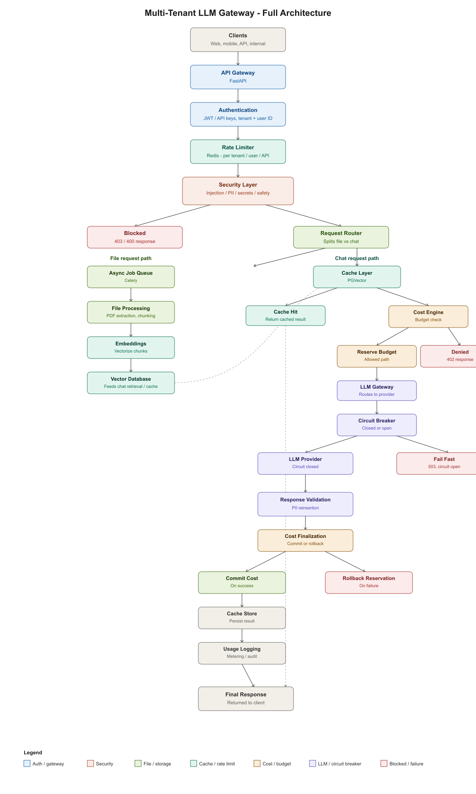

# ai-cost-guardrail

Building a gateway that sits in front of LLM API calls and handles the stuff you actually need in production but never see in tutorials — rate limits, cost tracking, PII scrubbing, a circuit breaker for when the provider goes down.

Basically: I kept reading about companies burning through OpenAI credits with no per-user limits, or a single flaky API call taking down an entire feature, and wanted to actually build something that solves that instead of just reading about it.

## What it does (or will do)

- Auth + tenant/user identification via JWT
- Per-tenant and per-user rate limiting using Redis
- Checks incoming requests for PII, prompt injection attempts, and leaked secrets before they go anywhere
- Reserves budget for a request *before* calling the LLM, so two concurrent requests from the same tenant can't both slip through and blow the budget
- Circuit breaker around the LLM call — if the provider starts failing, stop hammering it and fail fast instead
- Caches repeated queries so identical requests don't hit the LLM twice
- A separate path for file uploads — extract text, chunk it, embed it, store it for retrieval later

## Architecture

This is the target design, not what's built yet — see the checklist below for actual progress.

## Where it's at right now

Still early. Repo is set up, working on the actual gateway + auth right now.

- [x] Project setup, folder structure, dependencies
- [ ] `/chat` endpoint with real JWT auth
- [ ] Rate limiter (Redis)
- [ ] Security checks on incoming requests
- [ ] Cost engine (reserve/commit/rollback)
- [ ] Circuit breaker
- [ ] Caching layer
- [ ] File ingestion pipeline
- [ ] Docker compose so it's a one-command run

I'll update this as things get built instead of pretending it's all done.

## Stack

FastAPI, Redis, Celery, PGVector, uv for deps.

## Running it

Not runnable end-to-end yet. Will add setup steps once there's an actual endpoint to hit.

## Why

Wanted a project that goes past "call an LLM API and return the response" and actually deals with the things that break in production — concurrency bugs in budget tracking, what happens when a provider times out, that kind of thing. Not trying to make this look finished before it is.
