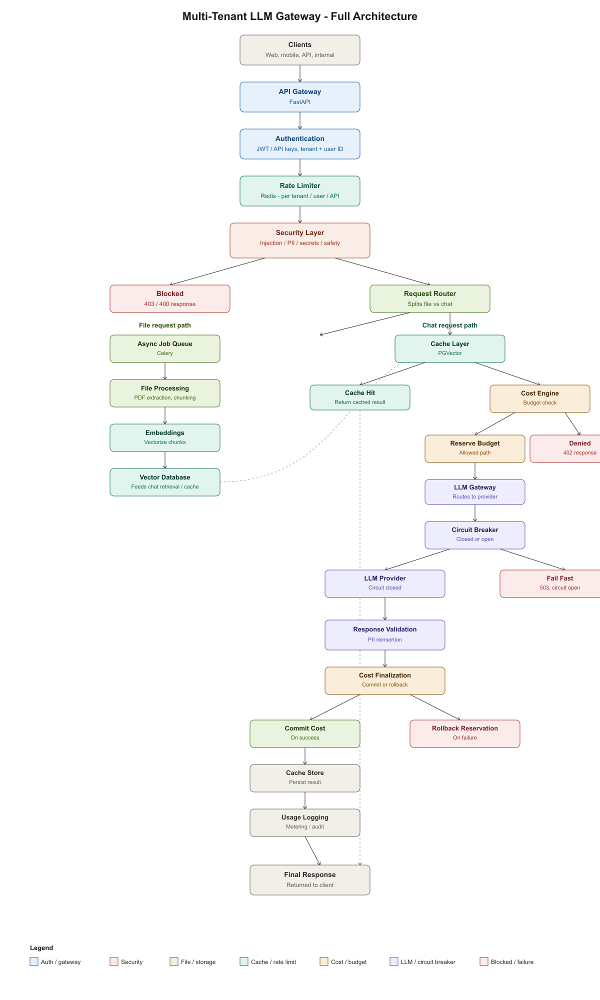

# ai-cost-guardrail

A backend and system-design learning project for building an **LLM Cost & Guardrail Gateway** — a service that sits between applications and LLM providers and handles the infrastructure around LLM calls: authentication, tenant isolation, rate limiting, budget enforcement, cost accounting, usage auditing, reliability, and retrieval-augmented generation (RAG).

The goal is not to pretend this is a complete enterprise AI platform. The goal is to build, test, and understand the engineering problems that appear around real LLM workloads.

---

## What it does

### LLM gateway

- JWT authentication with tenant/user identification
- Per-tenant Redis rate limiting with a distinct `429` response
- Model allowlisting and output-token limits checked before the provider call
- Provider-native input token counting using Gemini `count_tokens`
- Budget reservation **before** LLM generation
- PostgreSQL row locking to prevent concurrent requests from overspending a tenant budget
- Actual-usage settlement after generation
- Reservation refund when actual cost is lower than the reservation
- Reservation adjustment when actual cost exceeds the reservation
- Reservation release when a request fails
- Circuit breaker around the upstream LLM call
- Fail-closed behavior when provider token counting is unavailable
- Auditable `usage_records` containing request ID, operation, token usage, reserved/actual cost, and status
- Decimal-based monetary calculations backed by PostgreSQL `NUMERIC(12,6)`

### RAG foundation

- PDF text extraction with page-level provenance
- Deterministic, structure-aware recursive chunking
- Gemini `gemini-embedding-001` document/query embeddings
- PostgreSQL + pgvector vector storage
- Tenant-scoped document and chunk ownership enforced at the database level
- `vector(768)` embedding storage
- Embedding configuration fingerprints
- Composite tenant/document foreign-key enforcement
- `ON DELETE CASCADE` from documents to chunks
- Provider-independent `ContextPassage` retrieval interface
- Exact cosine-distance retrieval with tenant and fingerprint filtering
- Async grounded generation using the Google GenAI API
- Citation marker validation against retrieved passages
- Provenance tracking for retrieved context sent to the model
- Controlled handling of provider safety blocks and provider failures
- `POST /api/v1/rag/query` API endpoint with authentication, guardrails, request validation, tenant lookup, and response mapping

### Intentionally not implemented yet

- RAG usage/budget reservation and settlement across embedding + generation
- Final RAG end-to-end integration with real provider/database dependencies
- PII detection, prompt-injection detection, and secret-leak checks
- Semantic caching
- Distributed circuit-breaker state
- Distributed rate-limit state beyond Redis-backed counters
- Stale reservation recovery after process failure
- Advanced observability and tracing
- Additional LLM providers behind a common provider layer

---

## Architecture



The diagram represents the current gateway direction. Some broader extensions remain future work.

---

## Core request flow: LLM generation

```text
Client
  │
  ▼
JWT Authentication
  │
  ▼
Tenant / User Identification
  │
  ▼
Guardrails
  ├── Model Policy
  ├── Output Token Limit
  └── Redis Rate Limit
  │
  ▼
Provider Token Counting
  │
  ▼
Cost Reservation
  │
  ▼
PostgreSQL Budget Check + Row Lock
  │
  ▼
Circuit Breaker
  │
  ▼
LLM Provider
  │
  ├───────────────┐
  ▼               ▼
Success         Failure
  │               │
  ▼               ▼
Actual Usage   Release Reservation
  │               │
  └───────┬───────┘
          ▼
   Cost Settlement
          │
          ▼
    Usage Record
          │
          ▼
       Response
```

### Concurrency model

Budget enforcement is backed by PostgreSQL rather than an in-memory counter.

The tenant row is locked during reservation:

```text
Request A ─────┐
               ▼
          Lock tenant
               │
               ▼
          Check budget
               │
               ▼
            Reserve
               │
               ▼
            Commit
               │
               ▼
         Release lock
               │
Request B ───────────────────► Lock tenant
                                │
                                ▼
                           Check updated budget
                                │
                                ▼
                               ...
```

This prevents concurrent requests from independently seeing the same remaining budget and both spending against it.

---

## Cost and budget accounting

For the current `/api/v1/chat` flow:

1. Count estimated input tokens using the provider token-counting API.
2. Combine estimated input tokens with the maximum requested output tokens.
3. Calculate the maximum expected cost from model pricing.
4. Lock the tenant row with `SELECT ... FOR UPDATE`.
5. Verify that enough budget remains.
6. Reserve the amount and create a `usage_records` row with `status="reserved"`.
7. Call the LLM through the circuit breaker.
8. Read actual provider usage metadata.
9. Calculate the actual cost.
10. Settle the reservation.

Settlement rules:

```text
actual < reserved  → refund difference
actual > reserved  → charge shortfall
request fails       → release reservation
```

For Gemini thinking models, the billable output usage includes visible output tokens and thinking tokens.

Money is stored using PostgreSQL `NUMERIC(12,6)` and handled using Python `Decimal` rather than floating-point arithmetic.

---

## Usage accounting model

`UsageRecord` now distinguishes the billable operation associated with a request:

```text
UsageOperation
├── embed
└── generate
```

The uniqueness boundary is:

```text
(request_id, operation)
```

This allows a future RAG request to have one embedding operation and one generation operation under the same request ID without creating duplicate records for the same operation.

The usage service also supports atomic batch reservation for multiple operations under one tenant budget check. The current implementation is designed so the combined reservation is checked before any part of the batch is persisted.

---

## Circuit breaker

The gateway uses a circuit breaker around the upstream LLM call.

```text
CLOSED
  │
  │ repeated failures
  ▼
OPEN
  │
  │ recovery timeout
  ▼
HALF_OPEN
  │
  ├── success ──► CLOSED
  │
  └── failure ──► OPEN
```

The current circuit breaker is **per-process in-memory state**. A distributed breaker shared by multiple API instances is future work.

---

## API failure mapping

| Condition | HTTP response |
|---|---:|
| Missing/invalid authentication or invalid token claims | 401 |
| Invalid request / unsupported model / rejected token limit | 400 |
| Request schema validation failure | 422 |
| Rate limit exceeded | 429 |
| Redis/rate-limiter unavailable | 503 |
| Circuit breaker open | 503 |
| Provider token counting unavailable | 503 |
| Upstream LLM failure | 502 |
| RAG tenant not found | 404 |

---

## RAG workload

The project now contains the core RAG building blocks as well as the first API boundary.

### Current RAG path

```text
PDF
  ↓
Text Extraction
  ↓
Page-Level Provenance
  ↓
Deterministic Chunking
  ↓
Gemini Embeddings
  ↓
PostgreSQL + pgvector
  ↓
Exact Cosine Retrieval
  ↓
ContextPassage[]
  ↓
Grounded Generation
  ↓
Validated Citations
  ↓
RAG API Response
```

### Document storage

Documents are tenant-owned:

```text
tenants
  │
  └── documents
        │
        └── document_chunks
```

A document uses a UUID as its database identity.

A chunk uses an integer primary key while its logical identity is:

```text
(document_id, chunk_index)
```

The database also enforces the ownership relationship using:

```text
(tenant_id, document_id)
        ↓
documents(tenant_id, id)
```

This prevents a chunk belonging to one tenant from being attached to a document belonging to another tenant.

The chunk table stores:

- chunk text
- page provenance
- JSON metadata
- `vector(768)` embedding
- embedding fingerprint

Deleting a document cascades to its chunks.

### Embeddings

The current embedding model is:

```text
gemini-embedding-001
```

with:

```text
768 dimensions
```

Document and query embeddings use the provider's appropriate retrieval task configuration.

The embedding layer also maintains a configuration fingerprint so stored vectors can be associated with the embedding configuration that produced them.

Embedding pricing is represented separately in `CostEngine`, because embedding is a distinct billable operation from text generation.

### Chunking

Chunking is deterministic and structure-aware so that the same source text and configuration produce stable chunks.

The current splitter supports configurable chunk size and overlap and preserves page-level provenance from ingestion.

### Retrieval

The retrieval layer is separate from generation and uses a provider-independent `ContextPassage` representation.

The current retrieval strategy is exact nearest-neighbor search using cosine distance in pgvector, with:

- tenant filtering
- embedding fingerprint filtering
- configurable `top_k`
- optional maximum distance filtering
- provenance mapping back to source/page information

HNSW has **not** been added yet. The project will benchmark exact search before introducing approximate nearest-neighbor indexing.

The planned index, only if benchmarking justifies it, is HNSW with:

```text
vector_cosine_ops
```

### Generation

The RAG generation layer is intentionally independent of the vector store. It accepts retrieved evidence through `ContextPassage` and returns a structured `GenerationResult` containing the answer, validated citations, provenance, provider metadata, finish reason, and prompt version.

The generation layer:

- uses the asynchronous Google GenAI API
- refuses to call the LLM when no evidence is available
- treats retrieved document content as untrusted data rather than instructions
- validates citation markers against the passages actually supplied
- records invalid citation markers separately
- distinguishes expected safety blocks from provider failures
- applies a server-side maximum output-token cap

---

## RAG API

The current API boundary is:

```text
POST /api/v1/rag/query
```

The request body is intentionally small:

```json
{
  "query": "What is the refund policy?",
  "top_k": 5
}
```

Tenant and user identity come from the authenticated JWT rather than from the request body.

The current RAG API flow is:

```text
JWT
  ↓
Tenant / User Identification
  ↓
RAG Guardrails
  ├── output-token policy
  ├── model policy
  └── Redis rate limiting
  ↓
Tenant Validation
  ↓
RAGService
  ├── Query Embedding
  ├── Retrieval
  └── Grounded Generation
  ↓
RAGResponse
```

The endpoint is intentionally separated from `/api/v1/chat`.

`/chat` represents the normal LLM gateway path, while `/rag/query` represents the retrieval-augmented workload.

### RAG response

The API returns a structured response containing:

- request status
- generated answer
- validated citations
- requested `top_k`
- retrieved passage count
- stage timings
- embedding token count when available

Example shape:

```json
{
  "status": "answered",
  "answer": "The refund window is 30 days.",
  "citations": [
    {
      "ref": ["refund_policy.pdf", 3],
      "source": "refund_policy.pdf",
      "page": 3
    }
  ],
  "top_k": 5,
  "retrieved_count": 1,
  "timings_ms": {
    "embedding": 12,
    "retrieval": 8,
    "generation": 140,
    "total": 160
  },
  "embedding_tokens": 42
}
```

---

## RAG service boundaries

The RAG implementation is intentionally split into independent layers:

```text
Ingestion
    ↓
Chunking
    ↓
Embedding
    ↓
Retriever
    ↓
RAGService
    ↓
GenerationService
```

The pipeline orchestrator returns an `RAGAnswer` wrapper containing:

- generation result
- retrieved passage references
- per-stage timings
- embedding token usage when available

The pipeline does not own HTTP concerns, authentication, tenant lookup, rate limiting, or budget accounting.

Those responsibilities belong to the API/orchestration layer.

This separation makes it possible to test the RAG mechanics independently from the HTTP boundary.

---

## Database and migration design

The database uses PostgreSQL with pgvector.

Current vector extension configuration:

```text
pgvector
vector(768)
```

The RAG schema enforces tenant-safe document/chunk ownership at the database layer.

Important integrity rules:

```text
documents
    tenant_id + document_id
          ↓
document_chunks
```

and:

```text
document deletion
       ↓
chunk deletion
```

The migration history includes:

```text
tenants/users
    ↓
usage_records
    ↓
money → NUMERIC
    ↓
thinking_tokens
    ↓
remove orphaned budget status
    ↓
documents + document_chunks + pgvector
    ↓
usage operation
```

The current usage uniqueness boundary is:

```text
(request_id, operation)
```

No additional usage migration is required for the current state.

Migration/model drift can be checked with:

```bash
uv run alembic check
```

---

## Current status

The gateway currently provides:

- JWT-based tenant/user authentication
- Per-tenant Redis rate limiting
- Model allowlisting and output-token limits
- Provider-based input token counting
- PostgreSQL-backed budget reservation
- Actual usage settlement with refund/overage handling
- PostgreSQL usage auditing
- Circuit breaker protection around LLM generation
- Fail-closed provider token-counting behavior
- PostgreSQL + pgvector RAG storage
- Tenant-safe document/chunk ownership
- Deterministic PDF chunking
- Gemini embeddings
- Exact cosine retrieval
- Provider-independent RAG pipeline orchestration
- Grounded generation with validated citations
- RAG API guardrails
- `POST /api/v1/rag/query`
- Operation-aware usage accounting foundation
- Atomic batch budget reservation support
- Automated unit, service, database, pipeline, and API tests

### Test status

**161 tests passing**

The current total includes the newly added RAG API test suite.

---

## Implemented

- [x] Project setup and dependency management
- [x] FastAPI application structure
- [x] `/api/v1/chat` endpoint
- [x] JWT authentication with tenant/user identification
- [x] Authentication failure handling
- [x] Model policy and output-token limits
- [x] Redis-backed per-tenant rate limiting
- [x] Redis-unavailable handling
- [x] PostgreSQL tenant/user models + Alembic migrations
- [x] PostgreSQL-backed budget tracking with row-locked reservation
- [x] Provider-native input token counting
- [x] Fail-closed handling for provider token-counting failures
- [x] Model-aware CostEngine
- [x] Gemini thinking-token-aware generation cost calculation
- [x] Embedding cost model in CostEngine
- [x] Reservation/settlement lifecycle with actual usage-based costs
- [x] Reservation settlement when actual cost exceeds the reservation
- [x] Failed-request reservation release
- [x] `NUMERIC(12,6)` money storage with Python `Decimal`
- [x] Circuit breaker: closed/open/half-open
- [x] Circuit-breaker integration test coverage
- [x] Docker Compose development stack
- [x] Atomic Redis rate limiting using Lua
- [x] PDF text extraction with page-level provenance
- [x] Deterministic structure-aware document chunking
- [x] Gemini `gemini-embedding-001` embeddings
- [x] Async grounded generation
- [x] Numbered citation validation and provenance tracking
- [x] Generation provider error and safety handling
- [x] Server-side generation output-token cap
- [x] PostgreSQL + pgvector RAG storage
- [x] `documents` and `document_chunks` tables
- [x] Tenant-scoped document/chunk ownership
- [x] Composite tenant/document foreign-key enforcement
- [x] Document-to-chunk `ON DELETE CASCADE`
- [x] `vector(768)` embedding storage
- [x] Embedding fingerprint storage
- [x] Exact cosine-distance retriever
- [x] Retrieval tenant/fingerprint filtering
- [x] RAG pipeline service
- [x] RAG API schemas
- [x] `POST /api/v1/rag/query` endpoint
- [x] RAG authentication and guardrail API tests
- [x] RAG tenant-not-found handling
- [x] RAG response mapping tests
- [x] Operation-aware `UsageRecord`
- [x] `(request_id, operation)` uniqueness constraint
- [x] Atomic batch budget reservation in `UsageService`
- [x] RAG schema integrity tests
- [x] Alembic schema-drift verification with `alembic check`

---

## Next

The next focus is to finish the **cost-controlled RAG request lifecycle** without inventing inaccurate token estimates.

- [ ] RAG embedding budget reservation
- [ ] Determine/measure generation prompt input tokens after retrieval
- [ ] RAG generation budget reservation
- [ ] RAG usage settlement for embedding + generation operations
- [ ] End-to-end RAG integration tests with real database boundaries and mocked providers
- [ ] Upstream LLM timeout handling
- [ ] Stale reservation cleanup after process failure
- [ ] Security checks for PII, prompt injection, and leaked secrets
- [ ] Structured logs, metrics, and request tracing
- [ ] Harden `/token` and `/tenants` development endpoints
- [ ] RAG workload hardening and evaluation
- [ ] Benchmark exact search before adding HNSW
- [ ] HNSW vector index using `vector_cosine_ops`
- [ ] Caching layer
- [ ] Distributed circuit breaker
- [ ] Additional provider integration behind a common interface

---

## Project structure

```text
ai-cost-guardrail/
├── app/
│   ├── api/
│   │   ├── v1/
│   │   │   ├── __init__.py
│   │   │   ├── chat.py
│   │   │   ├── health.py
│   │   │   ├── rag.py
│   │   │   └── tenants.py
│   │   └── dependencies.py
│   │
│   ├── core/
│   │   ├── config.py
│   │   ├── database.py
│   │   └── security.py
│   │
│   ├── rag/
│   │   ├── chunking.py
│   │   ├── embeddings.py
│   │   ├── generation.py
│   │   ├── ingestion.py
│   │   ├── pipeline.py
│   │   └── retriever.py
│   │
│   ├── schemas/
│   │   ├── chat.py
│   │   └── rag.py
│   │
│   ├── services/
│   │   ├── circuit_breaker.py
│   │   ├── cost_engine.py
│   │   ├── guardrail.py
│   │   ├── models.py
│   │   ├── redis_client.py
│   │   └── usage.py
│   │
│   └── main.py
│
├── alembic/
├── docs/
│   └── architecture_diagram.png
├── tests/
│   ├── test_chat_api.py
│   ├── test_chunking.py
│   ├── test_circuit_breaker.py
│   ├── test_circuit_breaker_integration.py
│   ├── test_cost_engine.py
│   ├── test_embeddings.py
│   ├── test_generation.py
│   ├── test_guardrail.py
│   ├── test_ingestion.py
│   ├── test_pipeline.py
│   ├── test_rag_api.py
│   ├── test_rag_schema.py
│   ├── test_rag_schemas.py
│   ├── test_retriever.py
│   ├── test_usage_record.py
│   └── test_usage_service.py
│
├── .env.example
├── Dockerfile
├── docker-compose.yml
├── pyproject.toml
├── README.md
├── requirements.txt
└── uv.lock
```

---

## Stack

### In use

- Python
- FastAPI
- PostgreSQL
- pgvector
- SQLAlchemy
- Alembic
- Redis
- JWT
- Google Gemini
- Google GenAI SDK
- PyMuPDF
- uv
- pytest
- Docker / Docker Compose

### Planned

- Complete RAG accounting integration
- RAG workload evaluation and hardening
- Semantic caching
- Background processing where justified
- Advanced observability
- Additional LLM provider integration
- Distributed breaker state

---

## Running locally

### Docker Compose

```bash
docker compose up --build
```

This starts the API, PostgreSQL, and Redis and applies the configured database migrations as part of the development stack.

API documentation:

```text
http://127.0.0.1:8000/docs
```

The development `/token` endpoint can be used to obtain a JWT for local testing. It is development tooling and is not intended to represent a production authentication system.

### Local development

Start dependencies:

```bash
docker compose up -d postgres redis
```

Install/sync Python dependencies:

```bash
uv sync
```

Apply migrations:

```bash
uv run alembic upgrade head
```

Start the API:

```bash
uv run uvicorn app.main:app --reload
```

### Run tests

Full suite:

```bash
uv run pytest -q
```

Verbose:

```bash
uv run pytest tests -v
```

Migration/model drift check:

```bash
uv run alembic check
```

---

## Testing philosophy

The test suite is intentionally split by layer instead of relying only on large end-to-end tests.

```text
Unit tests
  ↓
Service / pipeline tests
  ↓
Database integrity tests
  ↓
API boundary tests
```

Examples:

- `test_cost_engine.py` validates monetary calculations and model/embedding pricing behavior.
- `test_usage_record.py` validates the `(request_id, operation)` uniqueness boundary.
- `test_usage_service.py` validates reservation, settlement, failure release, and atomic multi-operation reservation behavior.
- `test_retriever.py` validates tenant/fingerprint-aware vector retrieval.
- `test_pipeline.py` validates embed → retrieve → generate orchestration.
- `test_rag_api.py` validates HTTP authentication, guardrails, tenant handling, request validation, and response mapping.
- `test_rag_schema.py` validates database-level tenant ownership and cascade integrity.
- `test_rag_schemas.py` validates the external RAG request/response contract.

The objective is to make correctness boundaries explicit and keep unfinished infrastructure from being hidden behind a single happy-path integration test.

---

## Scope

This is a **backend and system-design learning project**, not an attempt to build a complete enterprise AI platform.

The primary focus is everything around the LLM call:

- authentication
- tenant isolation
- rate limiting
- guardrails
- cost reservation
- reliability
- usage accounting
- settlement
- retrieval
- grounded generation

PostgreSQL provides durable state, accounting, document metadata, and vector storage.

Redis provides fast, ephemeral state such as rate-limit counters.

RAG accounting, caching, multiple providers, distributed rate limiting and breaker state, stale reservation recovery, PII/secret handling, prompt-injection detection, background processing, and advanced observability are being added only when they support the project's learning objectives.

Features that are not necessary for demonstrating the gateway's core engineering concepts will remain future work rather than being added simply to make the project appear larger.

---

## Why this project?

Calling an LLM API is the easy part.

The interesting engineering problems appear around it:

- What happens when many users share one budget?
- How do you prevent concurrent requests from overspending?
- How do you account for actual token usage?
- What happens when the provider fails?
- How do you stop repeatedly sending traffic to a failing provider?
- How do you isolate tenants?
- How do you rate-limit requests?
- How do you recover a reservation if a process crashes?
- How do you support RAG without losing control of cost and reliability?
- How do you make vector retrieval tenant-safe?
- How do you verify that a generated answer is supported by retrieved evidence?
- When is approximate vector search worth the recall/complexity trade-off?

This project is an attempt to build those systems, test them, understand their trade-offs, and document what is actually implemented rather than pretending unfinished infrastructure is production-ready.

---

## Status at the end of today's session

**161 tests passing.**

Today's work added the first RAG API boundary and its dedicated API test suite. The next session starts with **RAG cost/budget accounting**, especially how to reserve and settle embedding and generation operations without relying on fabricated token estimates.